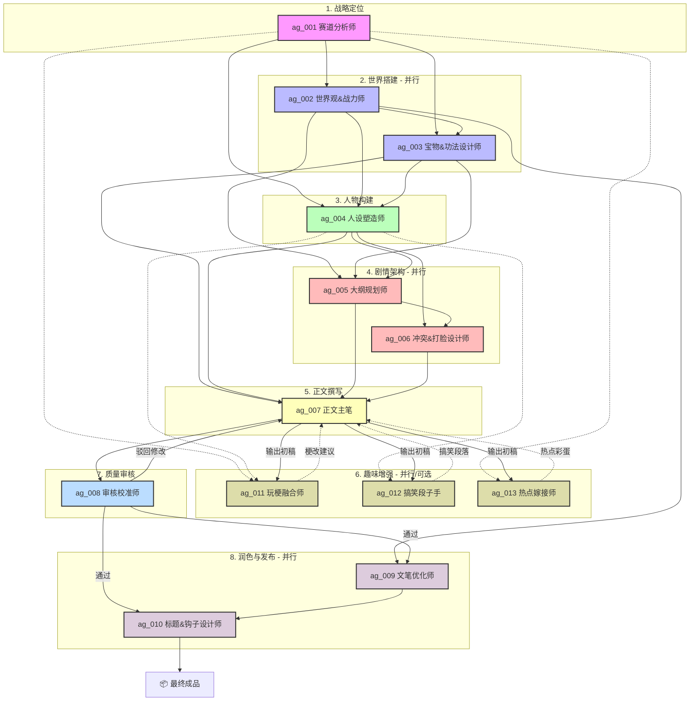

# 十三职能创作与返工流程

此文件保留原始13职能、8阶段、并行关系和审核返工路径。所有角色都必须完成；“并行”表示依赖满足后可同时进行。

## 八阶段与十三职能

### 第一阶段：战略定位

- `ag_001 赛道分析师`：确定受众、题材、核心情绪、价值观、主角缺口、一句话卖点和差异化；输入样本学习结论与项目内容规则。

### 第二阶段：世界搭建（并行）

- `ag_002 世界观&战力师`：建立时代、地域、行业/家庭规则、资源分布、人物权力差和不可破坏的世界规则。玄幻题材才使用字面战力体系。
- `ag_003 宝物&功法设计师`：设计会参与因果的关键道具、票据证据、职业技能、信息渠道和解决问题的现实能力。玄幻题材才使用字面宝物与功法。

### 第三阶段：人物构建

- `ag_004 人设塑造师`：读取 [故事结构与情绪设计](story-design.md)，设计主角、对立者、支持者和功能配角的年龄、关系、利益、缺点、能力、称呼、固定音色与人物弧线。

### 第四阶段：剧情架构（并行）

- `ag_005 大纲规划师`：读取 [故事结构与情绪设计](story-design.md)，输出逐章大纲、每章不可替代功能、开头钩子、结尾悬念、伏笔回收和最终结局。
- `ag_006 冲突&打脸设计师`：设计情绪债、升级路径和小中大回报。“打脸”只能通过事实、能力、证据、边界和责任兑现，不依赖财富、身份或暴力碾压。

### 第五阶段：正文撰写

- `ag_007 正文主笔`：严格按用户确认的大纲、人物设定、固定格式和字数口径逐章写作，不擅自改变因果、关系或结局。

### 第六阶段：趣味增强（并行可选）

- `ag_011 玩梗融合师`：只添加符合人物、时代和语境的轻量记忆点，不使用侵权梗、过时热梗或破坏情绪的插科打诨。
- `ag_012 搞笑段子手`：用人物性格、误差和生活反差制造轻喜，不拿弱势群体、伤害或低俗内容取笑。
- `ag_013 热点嫁接师`：只使用可核实且适合长期留存的现实议题；不得生硬蹭舆情、复用公众人物或把未经核实的信息写成事实。

三项增强为“角色检查必经、内容添加可选”：必须判断是否适用；不适用时明确记录“不添加”及原因，不能为了走流程强塞内容。

### 第七阶段：质量审核

- `ag_008 审核校准师`：审核要求覆盖、因果、人物、情绪、伏笔、格式、字数、内容安全、原创度和专业常识。通过后进入第八阶段；失败则列出具体缺口和返工目标，驳回相应阶段。

### 第八阶段：润色与发布（并行）

- `ag_009 文笔优化师`：在不改变设定、因果、台词意图和格式的前提下优化短句、动作、对白节奏与重复表达。
- `ag_010 标题&钩子设计师`：检查总标题、章节标题、开头5秒、章首承接和章尾悬念；不得使用低俗、夸张承诺或与正文不符的标题。

最终按用户要求生成成品和TXT交付。

## 原始依赖关系

## 返工规则

- 审核问题来自正文表达：返回 `ag_007`。
- 问题来自趣味或热点增强：撤销对应增强，再由 `ag_007` 合并。
- 问题来自冲突、伏笔或章节功能：返回 `ag_005/ag_006`，更新大纲后重新征求用户确认。
- 问题来自人物关系、称呼或弧线：返回 `ag_004`，并检查所有下游章节。
- 问题来自世界规则、行业逻辑、道具或证据：返回 `ag_002/ag_003`。
- 问题来自题材、受众、价值观或核心卖点：返回 `ag_001`，不得仅靠润色掩盖。
- 任何返工都必须重跑受影响阶段及其所有下游检查。
